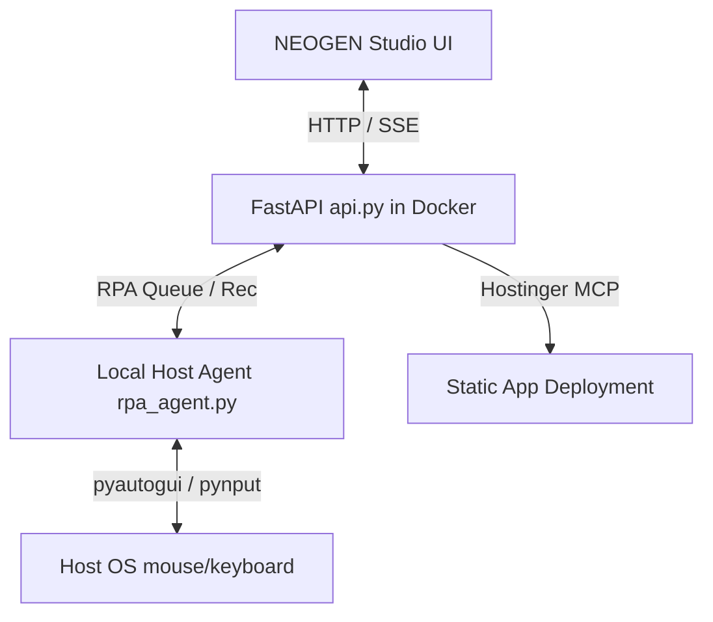

# Plan d'implémentation — Nouvelles capacités de NEOGEN (RPA, Imitation Learning, Déploiement Hostinger)

Ce plan décrit l'implémentation des trois nouvelles capacités demandées dans la section 4c du Handoff, sous la stricte gouvernance NEOGEN (sections 5 et 6) : consentement utilisateur par action, journal visible, arrêt d'urgence, et déploiement hors production.

---

## User Review Required

> [!IMPORTANT]
> **Architecture Hybride Docker / Hôte**
> Le service NEOGEN principal tourne dans un conteneur Docker. Cependant, un conteneur Docker isolé (surtout sous Windows/WSL2) ne peut pas interagir directement avec le serveur graphique de l'hôte pour piloter le clavier/souris (`pyautogui`) ni écouter les entrées utilisateur (`pynput`).
>
> Nous proposons d'introduire un **agent hôte léger** (`rpa_agent.py`) écrit en Python, que l'utilisateur lance sur sa machine hôte (`python rpa_agent.py`). Cet agent communique en HTTP avec le backend NEOGEN (Docker) pour :
> 1. Recevoir et exécuter les actions RPA (avec demande de confirmation locale).
> 2. Enregistrer les actions utilisateur en mode apprentissage (via des hooks système locaux) et les renvoyer au backend.
>
> **Garantie de Sécurité (Gouvernance NEOGEN) :**
> - L'agent hôte demande une **validation explicite à l'écran** (via boîte de dialogue UI ou invite terminal locale) avant d'exécuter la moindre action physique de souris ou clavier.
> - L'arrêt d'urgence est double : le Failsafe natif de PyAutoGUI (déplacer la souris au coin supérieur gauche) et un raccourci clavier global (ex: `Ctrl+Shift+Q` intercepté par l'agent).

---

## Open Questions

> [!WARNING]
> 1. **Boîte de dialogue de consentement locale :** Souhaitez-vous une invite de commande interactive dans le terminal où tourne `rpa_agent.py`, ou préférez-vous une boîte de dialogue graphique native (ex: popup `tkinter`) qui s'affiche au premier plan sur l'hôte pour chaque action ? (La popup graphique est recommandée pour le confort visuel).
> 2. **Exposition CORS pour Hostinger :** Lorsque le site statique est déployé sur Hostinger, il doit appeler l'API de NEOGEN (qui s'exécute localement ou sur un serveur privé) pour exécuter les produits. Nous devons donc ajouter des en-têtes CORS (`CORSMiddleware`) dans `api.py` pour autoriser les requêtes venant du domaine Hostinger déployé. Êtes-vous d'accord ?

---

## Proposed Changes

Nous allons modifier l'architecture de NEOGEN pour ajouter la capacité `bureau` (RPA) et intégrer les modules d'imitation et de déploiement.

---

### 1. Composant : Gouvernance & Capacités

#### [MODIFY] [capacites.py](file:///C:/Netroia/VIVARIUM/capacites.py)
- Ajouter la capacité `bureau` (RPA / computer-use) au catalogue.
- Étendre la classe `Capacites` pour supporter le flag `bureau`.
- Mettre à jour `contraintes_generation` pour indiquer à l'IA si elle a l'autorisation d'émettre des actions de bureau.

---

### 2. Composant : Exécution & Simulation RPA

#### [NEW] [rpa.py](file:///C:/Netroia/VIVARIUM/rpa.py)
- Création du gestionnaire RPA côté serveur.
- Gestion de la file d'attente d'actions (`RpaQueue`) : empiler des actions, dépiler pour l'agent, enregistrer les statuts d'exécution (en attente, approuvé, rejeté, exécuté, échec).
- Journalisation visible des actions exécutées (journal persistant dans `data/rpa_logs.jsonl`).
- Gestion des sessions d'imitation learning : stockage des séquences enregistrées sous `data/imitations/{nom}.json`.
- Fonctions pour éditer, supprimer et rejouer des séquences d'imitation.

#### [NEW] [rpa_agent.py](file:///C:/Netroia/VIVARIUM/rpa_agent.py)
- Script Python autonome à exécuter sur la machine hôte.
- Dépendances : `pyautogui`, `pynput`, `requests`.
- En boucle ou via polling WebSocket/HTTP, l'agent :
  - Interroge `/rpa/pending`.
  - Demande une confirmation locale (popup `tkinter` ou invite console) : *"NEOGEN souhaite faire un clic à (X, Y). Autoriser ? [Oui/Non]"*.
  - Exécute l'action avec `pyautogui` si validée, ou marque l'action comme rejetée.
  - Active le `pyautogui.FAILSAFE = True` pour l'arrêt d'urgence.
- En mode Enregistrement :
  - Active les listeners `pynput` pour intercepter les clics et frappes de l'utilisateur.
  - Envoie chaque action détectée au serveur (`POST /rpa/record/action`).
  - Permet d'arrêter l'enregistrement avec un raccourci clavier global (ex: `Ctrl+Shift+R`).

---

### 3. Composant : API Gateway & Endpoints

#### [MODIFY] [api.py](file:///C:/Netroia/VIVARIUM/api.py)
- **Endpoints RPA / Agent local :**
  - `GET /rpa/status` : Indique si l'agent local est connecté (via la date de son dernier ping).
  - `POST /rpa/agent/ping` : Permet à l'agent de signaler sa présence.
  - `GET /rpa/pending` : Permet à l'agent de récupérer la prochaine action à exécuter.
  - `POST /rpa/action/result` : Permet à l'agent de renvoyer le résultat d'une action (succès/échec/refus).
- **Endpoints Apprentissage par Imitation :**
  - `POST /rpa/record/start` : Démarre un enregistrement.
  - `POST /rpa/record/action` : Ajoute une action à la séquence en cours.
  - `POST /rpa/record/stop` : Enregistre la séquence sous forme de fichier JSON.
  - `GET /rpa/recordings` : Liste les enregistrements disponibles.
  - `DELETE /rpa/recordings/{name}` : Supprime un enregistrement.
  - `POST /rpa/recordings/{name}/replay` : Met la séquence d'imitation dans la file d'attente RPA.
- **Endpoints Déploiement Hostinger :**
  - `POST /produits/{produit_id}/deploy` : Construit l'archive ZIP statique du produit et invoque l'outil MCP `hosting_deployStaticWebsite` de `hostinger-mcp`.
- **En-têtes CORS :**
  - Activer `fastapi.middleware.cors.CORSMiddleware` pour permettre au site statique hébergé de faire des requêtes vers le serveur NEOGEN.

---

### 4. Composant : Interface Utilisateur Studio

#### [MODIFY] [ui.py](file:///C:/Netroia/VIVARIUM/ui.py)
- **Étape 4 (Production) :** Ajouter le choix de capacité "Piloter le bureau (RPA)".
- **Section Intégrations :**
  - Ajouter un panneau "Agent local RPA" indiquant le statut de connexion de `rpa_agent.py` (témoin lumineux Vert/Rouge).
  - Ajouter une section "Apprentissage par imitation" pour démarrer/arrêter l'enregistrement en direct, voir les séquences enregistrées, éditer les étapes ou les supprimer.
- **Section Production (Catalogue) :**
  - Pour chaque outil promu, ajouter un bouton **Déployer sur Hostinger**.
  - Afficher une modale demandant le nom de domaine de destination.
  - Lancer le déploiement en direct avec journalisation de l'avancement.

#### [MODIFY] [promotion.py](file:///C:/Netroia/VIVARIUM/promotion.py)
- Injecter la variable `NEOGEN_BASE_URL` dans le script de la page d'application (`_TEMPLATE`) afin que les appels AJAX pointent vers le serveur NEOGEN correct au lieu d'utiliser des chemins relatifs (nécessaire une fois déployé en externe).

---

## Verification Plan

### Automated Tests
- Création de tests unitaires hors-ligne dans `tests/test_rpa.py` validant :
  - L'empilement et le dépilement correct des actions de la file RPA.
  - La sérialisation/désérialisation des fichiers de séquence d'imitation.
  - L'intégration du CORS et de la réécriture de `NEOGEN_BASE_URL` dans les templates de promotion.

### Manual Verification
1. **Lancement de l'Agent local :**
   - Lancer NEOGEN via `docker-compose up -d --build`.
   - Lancer l'agent sur l'hôte : `python rpa_agent.py`.
   - Vérifier que l'UI affiche "Agent local : Connecté".
2. **Test RPA & Consentement :**
   - Déclencher une action RPA de test depuis l'UI.
   - Valider que l'agent sur l'hôte bloque et affiche une boîte de dialogue demandant confirmation.
   - Accepter, et vérifier le déplacement/clic physique.
   - Tester l'arrêt d'urgence en déplaçant le curseur au coin supérieur gauche.
3. **Test d'Imitation :**
   - Lancer l'enregistrement depuis NEOGEN Studio.
   - Effectuer quelques clics sur l'hôte.
   - Stopper l'enregistrement. Vérifier la liste des actions générées dans l'UI.
   - Rejouer la séquence et valider la ré-exécution conforme.
4. **Déploiement Hostinger :**
   - Cliquer sur "Déployer" sur un produit promu dans le catalogue.
   - Entrer un domaine de test.
   - Vérifier que l'appel à `hostinger-mcp` se déclenche et déploie le site statique.
